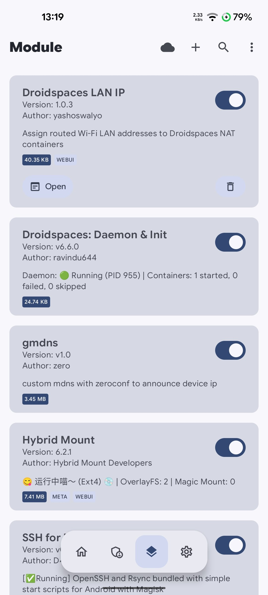
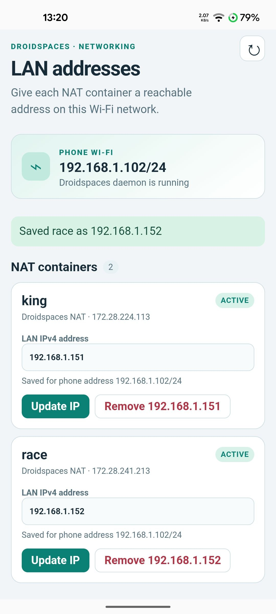
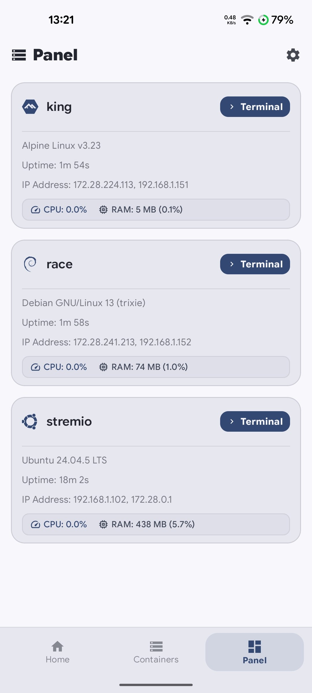
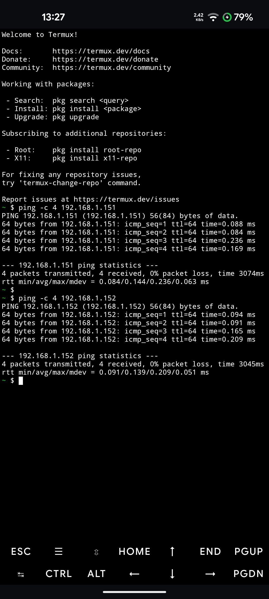

# Droidspaces LAN IP (KernelSU module)

This module gives a **Droidspaces NAT container** a separate IPv4 address on the phone's Wi-Fi LAN. It uses the container's existing `172.28.x.x` NAT link, a `/32` address inside the container, a host route through `ds-br0`, and a proxy ARP entry on `wlan0`. The phone keeps its own address and Wi-Fi MAC. The module does not change a container's network mode, start or stop containers, or configure applications inside them.

The module targets the Droidspaces 6.6.0 layout: `/data/local/Droidspaces/Containers/*/container.config`, `/data/local/Droidspaces/bin/droidspaces`, `ds-br0`, and NAT gateway `172.28.0.1`. It uses KernelSU's `webroot` WebUI and `boot-completed.sh` script. The worker waits for the Droidspaces daemon and checks saved mappings every 15 seconds, so it can reapply them after a container restart. It also installs a policy rule for the phone's Wi-Fi subnet, which Android needs to forward traffic to the container and answer proxy ARP. [KernelSU module guide](https://kernelsu.org/guide/module.html), [KernelSU WebUI guide](https://kernelsu.org/guide/module-webui.html)

## Screenshots

| Module list                                                                                                                                    | Module WebUI                                                                                                                                | Droidspaces panel                                                                                                                                     | Termux verification                                                                                                                 |
| ---------------------------------------------------------------------------------------------------------------------------------------------- | ------------------------------------------------------------------------------------------------------------------------------------------- | ----------------------------------------------------------------------------------------------------------------------------------------------------- | ----------------------------------------------------------------------------------------------------------------------------------- |
| <a href="research/modules_list.jpg"></a> | <a href="research/module_webui.jpg"></a> | <a href="research/droidspaces_panel.jpg"></a> | <a href="research/termux.jpg"></a> |

## Install and assign an address

1. Choose an unused IP on the **same Wi-Fi subnet as the phone**, and reserve or exclude it in your router's DHCP settings. The module checks the subnet and prevents duplicate assignments within its own config; it cannot detect every other device that might use the address.
2. From this directory, build the ZIP with `sh build.sh`. The file is `dist/droidspaces-lan-ip-1.0.0.zip`. The version in the filename comes from `module.prop`.
3. Install that ZIP in KernelSU Manager and reboot. Keep the Droidspaces module enabled. Open the **Droidspaces LAN IP** WebUI in KernelSU Manager.
4. Find the desired NAT container, enter the chosen IP, and tap **Assign IP**. Containers in host mode are not shown. The value is saved even if the container is stopped; it applies when the Droidspaces daemon and that container are running.
5. From another device on the LAN, ping the assigned IP and connect to a service that is actually listening inside the container. Use the container's assigned IP and the service's listening port in the URL.

The WebUI shows the phone's current Wi-Fi address, the daemon status, and each NAT container's mapping state. **Active** means the address, host route, proxy ARP entry, and LAN policy rule were found. **Pending** means the module has saved an IP but has not completed all network steps. **Stopped** means the container is not running. **Other LAN** means the phone's Wi-Fi address has changed since assignment; the module removes that mapping until you assign an address for the new LAN.

Configuration is stored in `/data/adb/droidspaces-lan-ip/assignments`, separate from the module directory so a module update can retain it. Each line is `container|LAN_IP|phone_IP/prefix`. The worker's output is in `/data/adb/droidspaces-lan-ip/worker.log`.

### Existing LAN IP watchers

If you previously installed a separate LAN IP watcher for a container, disable it **before** assigning that container an IP through this module. Otherwise the older watcher can restore its address after the WebUI removes it. On the Android host, rename its script in `/data/adb/service.d` so KernelSU no longer starts it, then reboot or stop that watcher's process.

The module does not alter older scripts automatically. If you stop a watcher manually, stop its process rather than the container process.

## Remove or change one container's address

Open the WebUI and tap **Remove IP** on that container's card. This deletes the saved assignment and removes its container `/32` address, LAN route, host route, and proxy ARP entry. The container stays in NAT mode. If its config has changed to host mode, the saved entry appears under **Saved for other modes** so it can still be removed. To change an IP, edit the input and tap **Update IP**; the old mapping is removed.

If a container still has an older proxy IP from a manual setup or startup script, the WebUI lists it under **Other proxy addresses on this container**. **Remove extra IP** clears that specific address, route, and proxy entry and reapplies the saved address as the container's LAN source. Stop any older startup script first, or it will recreate the extra IP.

To remove every mapping, remove them one by one or uninstall the module in KernelSU Manager. Uninstall runs a network cleanup and deletes `/data/adb/droidspaces-lan-ip`. Reboot after uninstall to stop its boot worker. Disabling a module in KernelSU without uninstalling takes effect after a reboot; existing live mappings may remain until then.

## Check a mapping from a root shell

Set `NAME` and `LAN_IP` to the selected container and its assigned address:

```sh
NAME=your-container
LAN_IP=your-assigned-ip
PID=$(droidspaces --name="$NAME" pid)
nsenter -t "$PID" -n -- ip -4 addr show dev eth0
nsenter -t "$PID" -n -- ip -4 route show
ip -4 route show "$LAN_IP/32"
ip neigh show proxy dev wlan0
/system/bin/sh /data/adb/modules/droidspaces-lan-ip/scripts/api.sh list
```

The container should show the assigned `/32` alongside its `172.28.x.x` address. The host route should point via that NAT IP on `ds-br0`, and the proxy neighbor entry should list the assigned LAN IP. If a browser cannot connect but ping works, check that the application is running and listening on the expected port inside the container. Some Wi-Fi networks isolate wireless clients and can block LAN access even when the mapping is correct.

## Build and test locally

Run `sh tests/test.sh`, `sh tests/policy-rule.sh`, `sh -n scripts/*.sh`, and `node --check webroot/app.js` from this directory. The shell tests use temporary mocks to check configuration operations and LAN policy rule management; they do not modify the phone.

## GitHub Actions

When this directory is the root of a GitHub repository, [the build workflow](.github/workflows/build.yml) checks the scripts, builds a KernelSU flashable ZIP with `module.prop` at the archive root, and uploads it as an Actions artifact on pushes, pull requests, and manual runs. Download the artifact from the workflow run, extract it once, and install the contained `.zip` in KernelSU Manager.

Pushing a version tag such as `v1.0.0` also creates a GitHub Release with the ZIP attached. The tag must match `version=1.0.0` in `module.prop`; update that value before tagging a new version. The module ZIP is available directly from the Release page without the extra Actions artifact wrapper.
